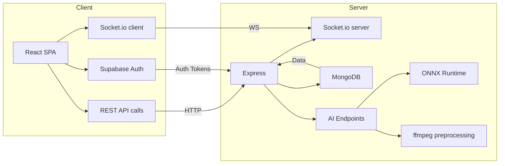

# AI Event Monitoring

> **Real‑time AI‑powered monitoring for public events**
>
> This repository powers an end‑to‑end platform that ingests video streams from events, applies on‑device AI models for crowd‑density and fire‑detection, and streams live alerts and analytics to a sleek React front‑end.

---

## 📌 Project Overview

The **AI Event Monitoring** system consists of two main components:

- **Client** – A modern React (Vite) application styled with Tailwind CSS.  It provides:
  - Real‑time chat powered by Socket.io.
  - Live dashboards showing crowd‑count, overcrowding alerts, and fire‑intensity metrics.
  - Integration with Supabase for authentication and data persistence.
- **Server** – An Express/Node.js backend that:
  - Manages WebSocket connections via Socket.io.
  - Stores user, event and message data in MongoDB.
  - Exposes AI inference endpoints (person‑count and fire‑detection) using ONNX‑runtime and `fluent‑ffmpeg` for video preprocessing.
  - Handles file uploads securely with Multer and forwards processed frames to the AI pipelines.

Together, the stack delivers a **responsive, low‑latency monitoring experience** that can be deployed to Vercel, Render, or any Docker‑compatible host.

---

## 🛠️ Architecture Diagram



---

## 🚀 Getting Started

### Prerequisites
- **Node.js** ≥ 20 (recommended LTS)
- **npm** (or **pnpm**/**yarn**)
- **MongoDB** instance (local or Atlas)
- **Docker** (optional, for containerised deployment)

### Installation
```bash
# Clone the repo
git clone https://github.com/karthik5649/AI-Event-Monitering.git
cd AI-Event-Monitering

# Install client dependencies
cd client && npm install && cd ..

# Install server dependencies
cd server && npm install && cd ..
```

### Environment variables
Copy the example files and fill in the required values:
```bash
cp client/.env.example client/.env
cp server/.env.example server/.env
```
Key variables include:
- `DB_URL` – MongoDB connection string.
- `CORS_ORIGINS` – Allowed origins for the API.
- `SUPABASE_URL` & `SUPABASE_ANON_KEY` – Supabase auth.
- `FIREBASE_...` – Firebase service credentials for push notifications.

---

## 📦 Running the Application

### Development mode
```bash
# Start the React client (Vite dev server)
cd client && npm run dev

# Start the Express server (watch mode optional)
cd server && npm run dev   # if a dev script is defined, otherwise `node server.js`
```
Visit `http://localhost:5173` (or the port shown by Vite) to see the UI.

### Production build
```bash
# Build the client
cd client && npm run build

# Serve the built assets via the Express server (static middleware can be added)
# Or deploy client and server separately to Vercel / Render.
```

---

## 🧪 Testing & Linting
```bash
# Client lint
cd client && npm run lint

# Server lint (uses ESLint)
cd server && npx eslint .
```
Unit‑test scaffolding can be added with Jest (client) and Mocha/Chai (server).

---

## 🤝 Contributing
1. Fork the repository.
2. Create a feature branch (`git checkout -b feat/awesome-feature`).
3. Commit your changes following the conventional‑commit style.
4. Open a Pull Request—describe the change, reference any related issue, and ensure CI passes.

Please respect the code‑style conventions defined in `.eslintrc` and `eslint.config.js`.

---

## 📄 License

This project is licensed under the **MIT License** – see the [LICENSE](LICENSE) file for details.

---

## 🙋‍♂️ Contact

For questions, open an issue or reach out to **Karthik Reddy** (karthik5649) via the repository’s Discussions tab.
